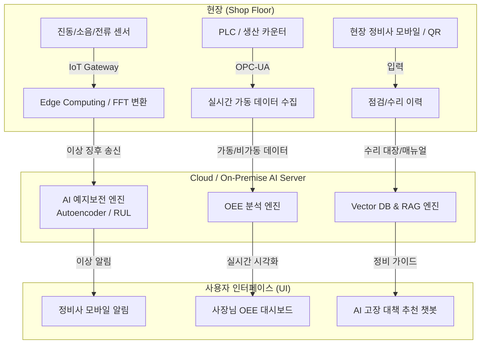

# [기획안] 중소 제조업을 위한 AI 기반 스마트 설비 관리 시스템 (Smart PMS & CMMS)

본 기획안은 IT 전문 인력과 예산이 부족하고, 현장 작업자의 디지털 숙련도 편차가 큰 중소 제조 공장의 현실적 제약을 극복하면서도, 도입 즉시 경영진(사장님)과 현장 정비사가 체감할 수 있는 확실한 효용(WOW 포인트)을 제공하는 것을 목표로 합니다.

---

## 1. 타겟별 'WOW' 가치 제안 (Value Proposition)

### 👨‍💼 사장님을 위한 WOW 포인트: "돈이 보이는 가시성과 모바일 한 손 경영"
*   **비용 환산 OEE 리포트:** 단순히 "가동률 78%"가 아니라, **"이번 달 돌발 정지로 인한 기회손실 비용 480만 원 발생"**과 같이 손실을 금액으로 직관화하여 보여줍니다.
*   **퇴근길 카카오톡 요약 브리핑:** 별도 시스템에 로그인하지 않아도, 매일 저녁 6시 카카오톡 알림톡으로 **"오늘의 공장 OEE, 주요 비가동 원인 Top 3, 내일 예정된 중요 예방정비"** 요약을 받아볼 수 있습니다.
*   **예지보전 ROI 시각화:** "AI 도입 후 방지한 다운타임 시간 및 절감된 정비 비용"을 누적 그래프로 보여주어 스마트팩토리 투자 효과를 증명합니다.

### 🛠️ 현장 정비사를 위한 WOW 포인트: "기름때 묻은 손을 위한 음성 제어와 챗봇"
*   **말하는 수리 대장 (STT 기반 자동 작성):** 좁고 어두운 현장에서 타자를 칠 필요 없이, **"3번 사출기 모터 베어링 마모 심해서 구리스 주입하고 볼트 조임 완료"**라고 말하면 AI가 정제된 문장으로 변환하여 수리 보고서를 자동 작성합니다.
*   **QR 코드 원터치 점검:** 설비에 붙은 QR 코드를 스캔하면 복잡한 검색 없이 **해당 설비의 매뉴얼, 과거 고장 이력, 오늘 점검해야 할 5개 항목**이 모바일에 즉시 팝업됩니다.
*   **퇴직한 반장님의 노하우 전수 (RAG 챗봇):** 현장에서 에러 코드가 떴을 때 **"압출기 E-03 에러 어떻게 해결해?"**라고 물어보면, 수십 년간 쌓인 과거 수리 대장과 매뉴얼을 찾아 **"3년 전 김 반장님이 히터 블록 접촉 단자를 청소해 해결한 사례가 있습니다. 조치 순서는 다음과 같습니다..."**라며 단계별 가이드를 즉시 제시합니다.

---

## 2. 5대 핵심 영역 상세 요구사항 및 기능 기획



### 1) 설비 예지보전 (Predictive Maintenance)
센서 데이터를 활용하여 설비 고장을 사전에 예측하고 남은 수명을 알려주어 불시 정지를 원천 차단합니다.

*   **센서 데이터 수집 및 특징 추출 (Feature Engineering):**
    *   **진동 센서 (가속도계):** 회전체(모터, 베어링, 감속기 등)에 부착하여 물리적 이상 거동 감지. FFT(고속 푸리에 변환)를 통해 시간 영역 데이터를 주파수 영역으로 변환하여 베어링 결함 주파수(BPFI, BPFO 등) 추출.
    *   **전류 센서 (비침습형 CT):** 모터 배선에 클램프 형태로 쉽게 설치. MCSA(모터 전류 분석) 기법을 사용해 고정자/회전자 결함 및 모터 과부하 감지. 설치가 간편하여 중소기업 도입에 최적.
    *   **온도/소음(초음파) 센서:** 과열 및 미세 마찰음을 추가 보조 지표로 활용.
*   **AI 모델 아키텍처:**
    *   **이상 탐지 (Anomaly Detection):** 정상 데이터만을 학습한 `Autoencoder` 또는 `Isolation Forest` 모델을 통해, 실시간 수집 데이터의 Reconstruction Error(재구성 오차)가 임계치를 넘으면 경고를 발생시킵니다.
    *   **잔여 수명 예측 (RUL, Remaining Useful Life):** `LSTM` 또는 `GRU` 기반 시계열 예측 모델을 적용하여 현재 열화 진행 속도를 바탕으로 **"고장 발생 예상 D-14일"**과 같이 정량적인 잔여 일수를 제공합니다.
*   **네트워크 인프라 최적화 (Edge-Cloud 하이브리드):**
    *   중소기업의 열악한 네트워크 대역폭을 고려하여, **IoT 게이트웨이(Edge)** 단에서 고주파 데이터(kHz 단위)를 FFT 필터링 및 다운샘플링한 후 필요한 특징점(RMS, Peak-to-Peak 등)만 클라우드로 전송해 트래픽 비용을 최소화합니다.

---

### 2) 실시간 설비 가동률 (OEE) 통계 시각화
설비의 가용성, 성능, 품질을 실시간 모니터링하여 공장 전체의 낭비 요소를 제거합니다.

*   **OEE 3대 요소 실시간 계산식:**
    $$\text{OEE} = \text{시간가동률(Availability)} \times \text{성능효율(Performance)} \times \text{양품률(Quality)}$$
    1.  **시간가동률 (Availability):** $\frac{\text{실제 가동 시간}}{\text{부하 시간(계획된 조업 시간 - 정기 휴식)}}$
        *   PLC의 RUN/STOP 접점 신호 또는 전류 센서 임계치를 기준으로 가동/비가동을 초 단위로 판정.
    2.  **성능효율 (Performance):** $\frac{\text{실제 생산 수량} \times \text{표준 사이클 타임 (Standard Cycle Time)}}{\text{실제 가동 시간}}$
        *   표준 속도 대비 미세 정지(Short Stoppage)나 속도 저하(Speed Loss)로 인한 손실을 실시간으로 감지.
    3.  **양품률 (Quality):** $\frac{\text{양품 수량 (총 생산 수량 - 불량 수량)}}{\text{총 생산 수량}}$
        *   비전 검사기 또는 터치패널을 통한 현장 불량 입력을 실시간 집계.
*   **비가동 원인 분석 및 시각화:**
    *   **파레토 차트 (Pareto Chart):** "비가동 요인 분석 대시보드"를 제공하여 전체 정지 시간의 80%를 차지하는 주원인(예: 자재 대기, 기종 변경, 모터 과부하 등)을 직관적으로 시각화.
    *   **동적 공장 레이아웃 뷰:** 현장 모니터 화면에 공장 배치도를 띄우고, 각 설비 카드의 색상(초록: 가동, 노랑: 대기, 빨강: 고장 정지)을 실시간 매핑하여 관리자가 한눈에 공장 상황을 파악하도록 설계.

---

### 3) 설비 점검 캘린더 및 소모성 부품 수명 관리 (CMMS)
부품 교체를 예방보전 일정과 유기적으로 연동하여 자재 고갈이나 불필요한 과다 재고를 방지합니다.

*   **스마트 부품 수명 차감 모델:**
    *   단순 시간 경과(예: 6달마다 교체)가 아닌, **실제 가동 누적 시간(Running Hours)**과 **부하 데이터(평균 구동 전류/온도 가중치)**를 곱해 부품의 실질 수명 잔량(%)을 하이브리드로 계산합니다.
    *   대상 부품: 모터, 베어링, 구동 벨트, 히터 카트리지 등 소모성 부품.
*   **점검 일정 자동 스케줄링:**
    *   부품 수명 예측치가 **15% 이하**로 떨어지면, 시스템이 자동으로 차주 점검 캘린더에 **"X호기 벨트 교체 및 장력 점검"** 일정을 생성하고 담당 정비사에게 배정합니다.
    *   간편한 드래그 앤 드롭 방식의 캘린더 UI로 정비 일정을 손쉽게 재조정할 수 있습니다.
*   **안전 재고 연동 알림:**
    *   부품 교체 일정이 스케줄링되면 자동으로 창고 내 해당 자재(예: 베어링 규격 6204)의 재고를 확인합니다. 재고가 안전 수준 이하일 경우 구매 담당자에게 **"교체 예정일(D-10) 대비 자재 발주 필요"** 알림을 전송합니다.

---

### 4) 모바일 현장 설비 예방 점검 양식 및 체크리스트
현장 정비사가 이동하면서 가볍게 사용할 수 있는 모바일 최적화 웹/앱 시스템을 구축합니다.

*   **현장 밀착형 UX/UI:**
    *   **QR 코드 즉각 연동:** 설비 본체에 부착된 QR 코드를 모바일 카메라로 스캔하면 바로 해당 설비의 상세 스펙, 점검 이력서, 오늘의 체크리스트 화면으로 진입합니다.
    *   **원터치 O/X 패널:** 정비사가 두꺼운 장갑을 낀 상태에서도 쉽게 누를 수 있도록 터치 영역을 대형화하고 직관적인 통과(Pass)/불합격(Fail) 버튼 제공.
*   **모바일 전용 입력 편의 기능:**
    *   **음성 메모 & 사진/동영상 업로드:** 이상 부위를 발견하면 모바일 카메라로 촬영해 사진 위에 빨간 펜으로 터치 스케치하고, 음성을 녹음하여 즉시 보고서에 첨부할 수 있습니다.
    *   **모바일 서명:** 작업 완료 후 현장 반장 또는 관리자의 모바일 서명을 직접 패널에 입력받아 결재 완료 처리.
*   **하이브리드 오프라인 모드:**
    *   무선 음영 지역(예: 지하시설, 철제 구조물 내부)에서 앱이 끊기지 않도록 모바일 로컬 DB(SQLite)에 점검 내용을 우선 저장한 뒤, Wi-Fi/LTE가 연결되는 구역으로 이동 시 클라우드 서버와 자동으로 데이터를 동기화합니다.

---

### 5) RAG 기반 과거 고장 대책 추천 시스템
현장 정비사의 기술 숙련도 격차를 해소하기 위해 LLM과 내부 정비 지식을 결합한 지능형 검색 서비스를 구현합니다.

*   **정비 지식 베이스(Knowledge Base) 구축:**
    *   기존 공장의 수기 정비 대장(스캔본 OCR 처리), 엑셀 조치 이력, 설비 제작사 제공 PDF 매뉴얼 문서를 텍스트 청킹(Chunking)하여 Vector DB(예: FAISS, ChromaDB)에 보관합니다.
*   **RAG(Retrieval-Augmented Generation) 작동 프로세스:**
    ```
    [정비사 자연어 질문] "사출기 형폐 압력 저하 발생 시 조치법?"
           ↓
    [Vector DB 시맨틱 검색] 관련 과거 수리 이력 및 매뉴얼 텍스트 검색 (유사도 기준 Top 3 추출)
           ↓
    [프롬프트 컨텍스트 결합] LLM에 검색 결과와 질문을 결합하여 전달
           ↓
    [AI 정답 생성] "과거 2024년 5월에 유압 밸브 솔레노이드 고장으로 동일 증상이 해결된 이력이 있습니다. 다음 순서로 확인해 보세요..."
    ```
*   **대화형 정비 어시스턴트:**
    *   모바일 웹/앱 내에 챗봇 인터페이스를 내장하여 카카오톡을 쓰듯 편하게 대화식으로 질문할 수 있으며, 추천 조치 사항과 함께 해당 부품의 사내 보관 창고 위치(예: "자재창고 A동 3번 선반")까지 결합하여 답변합니다.
