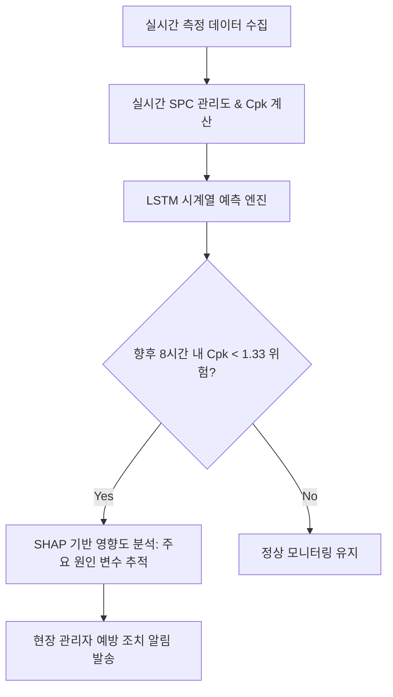
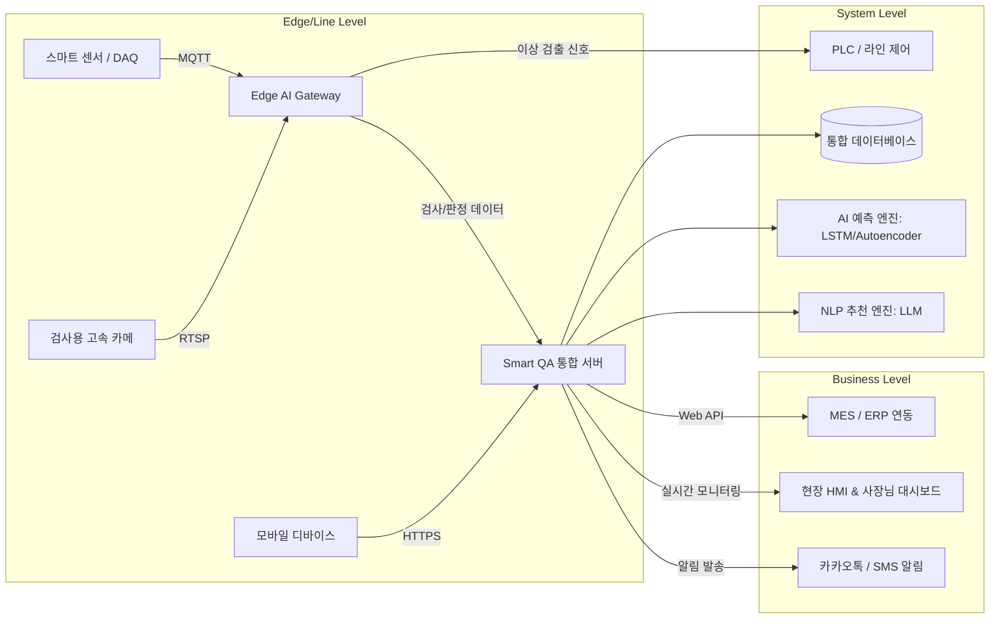

# [기획안] 중소 제조업 특화 지능형 품질관리 AI 시스템 (Smart QA/QC Platform)

## 1. 개요 및 기획 배경
국내 중소 제조기업은 불량 데이터 확보의 어려움, 품질 전문 인력 부족, 수기 문서 기반의 파편화된 부적합 관리 등 다양한 페인 포인트(Pain Point)를 겪고 있습니다. 본 기획안은 이러한 문제를 해결하고 현장의 작업자와 사장님이 즉각적인 도입 효과를 체감할 수 있도록 **비지도 학습(Unsupervised) 기반 비전 검사, 시계열 AI SPC 예측, 모바일 현장 검사 및 지능형 NCR-CAPA 루프**를 통합한 엔드투엔드(End-to-End) 솔루션을 제안합니다.

---

## 2. 5대 핵심 기능 및 상세 요구사항

### 🚀 핵심 기능 1: 정상 이미지 기반 비지도학습 Vision AI 불량 검출
> **"불량 데이터 수집으로 시간 낭비하지 마세요. 정상 이미지만으로 바로 검사를 시작합니다."**

*   **비지도 이상 탐지 (Unsupervised Anomaly Detection)**
    *   **요구사항**: 불량 발생 빈도가 낮거나 다품종 소량 생산을 하는 제조 라인에서, 정상 제품 이미지(Golden Sample) 약 50~100장만으로 초기 학습이 가능한 모델 적용 (예: Anomalib 라이브러리 기반의 PatchCore 또는 FastFlow 알고리즘).
    *   **기능**: 학습되지 않은 미세 스크래치, 찍힘, 크랙, 이물, 미성형 등의 이상 패턴을 정상 패턴과의 차이(Anomaly Score)로 즉각 검출.
*   **설명 가능한 AI (XAI) 시각화**
    *   **기능**: AI가 불량으로 판정한 근거를 히트맵(Grad-CAM) 형태로 시각화하여, 제품 표면의 어느 위치가 왜 이상한지 작업자 화면(HMI)에 직관적으로 하이라이트 표시.
*   **Edge 단 실시간 추론 및 PLC/컨베이어 연동**
    *   **요구사항**: 생산 라인의 속도에 맞추어 초당 30프레임(30 FPS) 이상으로 판정할 수 있는 NVIDIA Jetson 계열의 엣지 컴퓨팅 하드웨어 활용.
    *   **연동**: 불량 판정 시 OPC-UA 또는 Digital I/O 신호를 통해 PLC에 즉각 신호를 전달하여 컨베이어 벨트를 정지시키거나, 에어 실린더(리젝터)를 작동하여 불량품을 자동으로 배출 라인으로 격리.
*   **작업자용 노코드(No-Code) 모델 재학습 콘솔**
    *   **기능**: 현장 실무자가 신규 제품 추가나 불량 유형 업데이트 시, 외부 개발자 도움 없이 직접 신규 이미지를 업로드하고 원클릭으로 모델을 재학습 및 배포할 수 있는 간결한 웹 UI 제공.

---

### 📊 핵심 기능 2: 통계적 공정 관리(SPC) 시각화 및 AI 기반 Cpk 예측
> **"품질이 나빠지고 나서 대책을 세우면 늦습니다. 미래의 공정 능력을 AI가 한발 앞서 경고합니다."**

*   **실시간 SPC 관리도 및 공정능력지수 시각화**
    *   **기능**: 현장의 계측기(마이크로미터, 디지털 캘리퍼스 등)나 설비 센서 데이터를 연동하여 실시간 X-bar R 관리도, Histogram, 정규분포 곡선을 자동으로 생성.
    *   **계산**: 공정 능력 지수인 $C_p$ 및 $C_{pk}$ 값을 매 배치(Batch) 또는 시간 단위로 자동 계산하여 시각화 대시보드에 표기.
*   **AI 기반 미래 불량률 및 Cpk 저하 시계열 예측**
    *   **요구사항**: LSTM(Long Short-Term Memory) 또는 ARIMA-LSTM 하이브리드 시계열 모델 탑재.
    *   **기능**: 최근 공정 파라미터와 누적 측정값의 추세를 학습하여, **"향후 4~8시간 이내에 공정능력지수 $C_{pk}$가 관리 하한선(예: 1.33) 미만으로 하락할 확률"** 또는 불량률 치솟을 시점을 사전 예측하여 알림 제공.
*   **공정 변수 영향도 분석 (Feature Importance)**
    *   **기능**: $C_{pk}$ 저하 추세 감지 시, 다변량 상관관계 분석(SHAP Value 기법)을 수행하여 "어떤 공정 변수(예: 사출 압력, 가열 온도 등)가 품질 저하에 가장 큰 기여를 하고 있는지" 원인 분석 순위를 작업자에게 제공.

---

### ⚙️ 핵심 기능 3: 설비 데이터 기반 공정 이상 징후 조기 감지
> **"설비의 보이지 않는 미세한 떨림과 전류 변화를 포착하여 고장과 품질 사고를 사전에 방지합니다."**

*   **다변량 센서 데이터 실시간 연동**
    *   **요구사항**: 설비에 부착된 스마트 센서(진동, 전류, 온도, 가압력, 압력 등)의 아날로그 신호를 DAQ(데이터 수집 장치)를 통해 수집하고 MQTT/OPC-UA 프로토콜을 사용해 통합 서버로 실시간 스트리밍.
*   **비지도 학습 기반 다변량 이상 탐지 (Multi-variate Anomaly Detection)**
    *   **요구사항**: 오토인코더(Autoencoder) 또는 Isolation Forest 모델 적용.
    *   **기능**: 정상 가동 상태의 다차원 센서 데이터의 기하학적 분포 패턴을 학습한 후, 기계 마모나 오작동으로 인해 미세하게 어긋나는 신호(Reconstruction Error의 임계치 초과)를 실시간으로 탐지.
*   **이상 징후 다차원 기여도 분석**
    *   **기능**: 이상 징후가 발생했을 때 진동 센서 3번(기여도 65%), 전류 센서 1번(기여도 20%)과 같이 어떤 센서 신호의 변동이 가장 지배적이었는지를 대시보드에 직관적으로 시각화하여 정비사의 빠른 원인 진단을 보조.

---

### 📱 핵심 기능 4: 모바일 현장 품질 검사 양식 및 모바일 체크리스트
> **"수기 작성과 종이 문서는 끝났습니다. 바코드 스캔 한 번으로 모바일 체크리스트를 완료하세요."**

*   **반응형 모바일 검사 웹/앱**
    *   **요구사항**: 현장 작업용 태블릿 및 스마트폰에 최적화된 반응형 모바일 인터페이스 구축.
    *   **기능**: 작업자가 모바일 카메라로 원자재 또는 제품의 QR/바코드를 스캔하면 Lot 번호가 자동 매핑되고, 해당 공정에 맞는 검사 체크리스트(수입검사, 공정검사, 출하검사 등)가 자동으로 활성화.
*   **현장 사진/동영상 첨부 및 Vision AI 보조 판정**
    *   **기능**: 현장에서 육안 검사 중 애매한 결함 발견 시, 모바일로 직접 촬영하면 모바일 내장 경량 Vision AI가 1차적으로 합/부 판정을 조언("결함 가능성 85% - 오염 의심"). 촬영한 이미지는 체크리스트 및 부적합 보고서에 즉시 고화질 증적 자료로 동기화.
*   **전자 서명 및 실시간 MES/ERP 연동**
    *   **기능**: 검사 완료 후 작업자가 모바일 화면에 직접 수기 서명 시 검사 정보가 즉시 서버로 전송되어 종이 보관 비용 제로화(Paperless) 및 이력 추적성(Traceability) 확보.

---

### 🔄 핵심 기능 5: 부적합 보고서(NCR) 관리 및 시정 조치(CAPA) 피드백 루프
> **"문제가 생겼을 때 신속하게 공유되고, 과거에 해결했던 조치법을 AI가 바로 알려줍니다."**

*   **자동 NCR 발행 및 워크플로우 엔진**
    *   **기능**: Vision AI의 불량 판정이나 모바일 품질 검사 부적합 입력, 혹은 SPC 한계선 이탈 시 자동으로 NCR(Non-Conformance Report) 티켓이 생성되며 해당 공정 조장 및 품질 담당자에게 알림톡(카카오톡/SMS) 발송.
*   **지능형 8D / 5-Why 원인 분석 작성 가이드**
    *   **기능**: 현장 담당자가 즉시 부적합품 격리 조치 후, 근본 원인을 파악할 수 있도록 5-Why 작성 템플릿 및 영구 조치(CAPA, Corrective and Preventive Action) 수립 워크플로우 제공.
*   **LLM 기반 과거 유사 부적합 조치 이력 추천**
    *   **요구사항**: 로컬 LLM 또는 벡터 데이터베이스 기반의 유사 문서 검색(RAG) 엔진 적용.
    *   **기능**: 발생한 부적합 현상 텍스트와 불량 코드를 분석하여 **"과거 3년 동안 발생한 유사 불량 사례 TOP 3"**와 당시 **"가장 효과적이었던 CAPA 해결 방안 및 개선 후 유효성 검증 문서"**를 담당자 화면에 팝업 추천하여 휴먼 에러 재발을 방지.

---

## 3. 중소 제조업 사장님과 실무자를 사로잡는 3대 와우(WOW) 포인트

1.  **초기 데이터 수집 부담 Zero: "정상 제품 몇 개만 찍어두세요."**
    *   중소기업의 가장 큰 허들인 '불량 데이터 부족'을 비지도 학습 기반 Anomaly Detection으로 극복하여 도입 첫날부터 바로 활용할 수 있는 실용성.
2.  **카카오톡 기반 실시간 품질 비서: "지금 조치가 시급합니다!"**
    *   설비 이상 징후나 4시간 뒤 불량률 급증 예측 발생 시, 사무실에 앉아있는 사장님과 현장 작업자 모두에게 카카오톡 알림으로 알리고 즉시 모바일에서 조치 현황(격리 완료, CAPA 등록 진행 중)을 확인할 수 있어 관리의 끈을 놓지 않음.
3.  **사라진 종이와 스마트한 이력 추적: "바코드 찍으면 언제, 누가, 어떤 조건으로 만들었는지 한눈에!"**
    *   현장의 지저분한 종이 체크리스트를 모바일로 전환하여 IATF 16949 등의 품질 표준 심사를 손쉽게 통과하고, 클레임 발생 시 Lot 추적 속도를 며칠에서 단 5초로 단축.

---

## 4. 시스템 아키텍처 다이어그램

